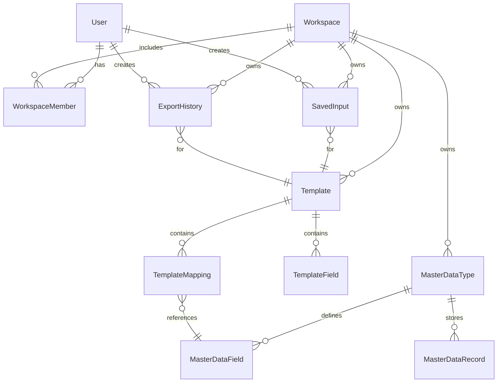

# Part 5. Workspace Ownership

**Phase:** 7.1.0 (architecture) · 7.1.1 (entity classes in `com.company.xmlgen.workspace.entity` — JPA `@Entity` deferred to 7.1.2)

---

## 1. Purpose

Define **Workspace** as the business ownership boundary for XMLGen.

Workspace groups everything an operator configures and everything a user generates within one isolated context.

---

## 2. Ownership Model

### Current (pre-7.1)

```text
User
 ├── SavedInput        (user_id + template_id)
 └── ExportHistory     (user_id + template_id)

Template               (global)
MasterDataType         (global)
```

User identity controls draft and export visibility. Templates and master data are system-global.

### Proposed (7.1+)

```text
User
 └── WorkspaceMember
        └── Workspace
               ├── Template
               ├── MasterDataType
               ├── SavedInput
               └── ExportHistory
```

**User** authenticates to the system.  
**Workspace** scopes business data.  
**WorkspaceMember** grants a user access to a workspace with a role.

---

## 3. Workspace Entity

```text
Workspace
---------
id

code                 -- unique within system (e.g. DEFAULT, ACME-PROD)

name

description          -- nullable

status               -- ACTIVE | INACTIVE

created_by           -- FK -> users.id

created_at
updated_at
deleted_at           -- nullable (align with existing soft-delete TD)
```

### Notes

- `code` is a stable identifier for migrations and API references.
- `status = INACTIVE` prevents new operations but retains history (policy TBD in 7.1.1).

---

## 4. WorkspaceMember Entity

```text
WorkspaceMember
---------------
id

workspace_id         -- FK -> workspaces.id

user_id              -- FK -> users.id

role                 -- WORKSPACE_ADMIN | WORKSPACE_USER

created_at
updated_at
```

### Constraints

```text
UNIQUE(workspace_id, user_id)
```

### Role semantics (Phase 7.1.1 baseline)

| Role | Capabilities |
| ---- | ------------ |
| WORKSPACE_ADMIN | Template CRUD, master data CRUD, XML generation, export history |
| WORKSPACE_USER | XML generation, saved inputs, export history (own records) |

System-level `is_admin` on `User` may bypass workspace checks for operations tooling (explicit decision in 7.1.1 security review).

---

## 5. Owned Entities — FK Additions

Each owned entity gains:

```text
workspace_id         BIGINT NOT NULL FK -> workspaces.id
```

| Entity | Additional scope notes |
| ------ | ---------------------- |
| Template | `UNIQUE(workspace_id, code)` replaces global `UNIQUE(code)` |
| MasterDataType | `UNIQUE(workspace_id, code)` replaces global unique on code |
| SavedInput | `UNIQUE(workspace_id, user_id, template_id)` |
| ExportHistory | Indexed by `workspace_id`; filtered lists default to current workspace |

Child entities (`template_fields`, `master_data_fields`, etc.) inherit workspace scope **transitively** through their parent aggregate root. No redundant `workspace_id` on child tables unless query performance requires it (deferred).

---

## 6. Aggregate Boundaries

```text
┌─────────────────────────────────────────────────────────────┐
│  Ownership scope: Workspace                                  │
│  (authorization + uniqueness boundary — not one transaction) │
└─────────────────────────────────────────────────────────────┘
         │
         ├── Template aggregate
         │      TemplateField, TemplateMapping, TemplateGuide
         │
         ├── MasterDataType aggregate
         │      MasterDataField, MasterDataRecord
         │
         ├── SavedInput (simple entity, one per user+template per workspace)
         │
         └── ExportHistory (immutable snapshot entity)
```

### Invariants

1. A `TemplateMapping` must not reference a `MasterDataField` from another workspace.
2. `SavedInput.template_id` must reference a template in the same workspace.
3. `ExportHistory.template_id` must reference a template in the same workspace.
4. Preview/Export requests must resolve template + master data within one workspace.

The **Runtime Engine** remains unchanged — it receives `compiled_schema_json` and input payloads. Workspace enforcement happens in application services before orchestration.

---

## 7. Entity Relationship (proposed)



---

## 8. Application Workspace Context (Phase 7.1.4)

Workspace Context is the canonical application boundary resolved on every API request before business services execute.

```text
HTTP Request
    ↓
JWT Authentication
    ↓
WorkspaceContextFilter
    ↓
WorkspaceContextResolver  (exists + ACTIVE)
    ↓
WorkspaceContextHolder
    ↓
Application Service
    ↓
Business Resources
```

### WorkspaceContext

Immutable value object:

```text
WorkspaceContext
    workspaceId
    workspaceCode
```

No user identity. No permissions. Workspace only.

### Resolution

| Priority | Source | Example |
| -------- | ------ | ------- |
| 1 | `X-Workspace-Id` header | `X-Workspace-Id: 1` |
| 2 | `workspaceId` query parameter | `?workspaceId=1` |

If neither is present: `WORKSPACE_REQUIRED` (HTTP 400). No silent fallback to Default Workspace.

### Request lifecycle

1. `WorkspaceContextFilter` extracts workspace id (header, then query param).
2. `WorkspaceContextResolver` loads workspace, rejects unknown (`INVALID_WORKSPACE`) or inactive (`WORKSPACE_INACTIVE`).
3. `WorkspaceContextHolder.set()` for the request thread.
4. Filter chain continues to controllers/services.
5. `WorkspaceContextHolder.clear()` in a `finally` block — no cross-request leakage.

Compile Engine and Runtime Engine remain workspace-agnostic. Services consume `WorkspaceContextHolder` starting in Phase 7.1.5.

---

## 9. Domain Events (future — not Phase 7.1.1)

Not implemented in MVP. Documented for extension:

- `WorkspaceCreated`
- `WorkspaceMemberAdded`
- `WorkspaceMemberRemoved`

No event bus in Phase 7.1.1.

---

## 10. Relationship to Existing Domain Sections

| Existing doc section | Change |
| -------------------- | ------ |
| §3 User | Add relationship to WorkspaceMember |
| §4 Template | Add `workspace_id`; code unique per workspace |
| §8 MasterDataType | Add `workspace_id`; code unique per workspace |
| §11 SavedInput | Add `workspace_id`; update unique constraint |
| §12 ExportHistory | Add `workspace_id` |
| §13 ER Summary | Superseded by this part for ownership |

---

## 11. Phase 7.1.1 Handoff

Implementation order (recommended):

1. `workspaces`, `workspace_members` tables
2. Add nullable `workspace_id` to owned tables → backfill → NOT NULL
3. Replace unique indexes
4. Workspace membership service + authorization guard
5. Extend list APIs with `workspaceId`
6. Frontend workspace context + selector

See [Phase 7.1.0 deliverable](../release/phase-7.1.0-workspace-architecture.md).
