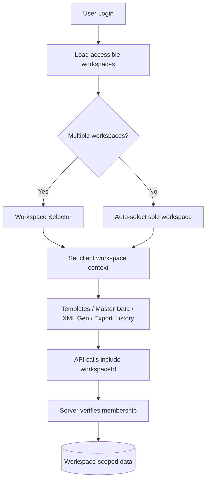
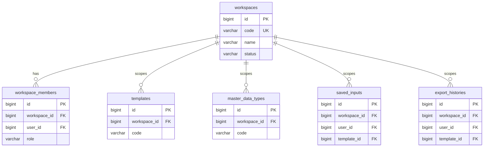

# Phase 7.1.0 — Project Workspace Architecture

**Status:** Approved (architecture only)  
**Date:** 2026-06-30  
**Next phase:** 7.1.1 — Workspace implementation (CRUD, migration, API, UI selector)

---

## 1. Goal

Introduce **Workspace** as the business ownership root for Templates, Master Data, Saved Inputs, and Export History.

This phase produces architecture and documentation only. No code, migrations, or REST endpoints.

---

## 2. Executive Summary

| Topic | Decision |
| ----- | -------- |
| Ownership root | **Workspace** scopes all business data |
| Aggregate roots | Template, MasterDataType, SavedInput, ExportHistory **unchanged** as transactional boundaries |
| Database | New `workspaces`, `workspace_members`; `workspace_id` FK on four owned tables |
| API style | **`?workspaceId=`** on collections; `workspaceId` in create body; [ADR-003](../adr/ADR-003-workspace-ownership.md) |
| UI | Workspace selector → feature navigation (unchanged feature set) |
| Migration | Single **Default Workspace** (id=1); backfill all rows |
| Backward compat | Optional `workspaceId` during 7.1.1 transition; default to user's primary workspace |
| Engine impact | **None** — Runtime Engine remains workspace-agnostic |

---

## 3. Architecture Overview

### 3.1 Layer diagram

```text
┌──────────────────────────────────────────────────────────────────┐
│                     Presentation (React)                          │
│  WorkspaceSelector → AppContext.workspaceId → feature modules     │
└────────────────────────────┬─────────────────────────────────────┘
                             │ REST (X-Workspace-Id / workspaceId)
┌────────────────────────────▼─────────────────────────────────────┐
│                   Application Layer                              │
│  WorkspaceContextFilter → WorkspaceContextHolder                 │
│  WorkspaceMembershipGuard (7.1.5+) → TemplateService, ...        │
└────────────────────────────┬─────────────────────────────────────┘
                             │
┌────────────────────────────▼─────────────────────────────────────┐
│              Domain (aggregates unchanged internally)               │
│  Template │ MasterDataType │ SavedInput │ ExportHistory             │
└────────────────────────────┬─────────────────────────────────────┘
                             │
┌────────────────────────────▼─────────────────────────────────────┐
│  Infrastructure — PostgreSQL                                      │
│  workspaces │ workspace_members │ * + workspace_id FK             │
└──────────────────────────────────────────────────────────────────┘

        Runtime Engine (Preview/Export) — no workspace awareness
        receives compiled_schema_json + input payloads only
```

### 3.2 Ownership flow



---

## 4. Domain Ownership

Full detail: [p5_workspace-ownership.md](../02-domain-model/p5_workspace-ownership.md)

### Approved model

```text
User
 └── WorkspaceMember
        └── Workspace
               ├── Templates
               ├── Master Data Types
               ├── Saved Inputs
               └── Export Histories
```

### Workspace vs aggregate root

| Concept | Role |
| ------- | ---- |
| **Workspace** | Ownership / tenant boundary; uniqueness scope; authorization context |
| **Template** | Aggregate root for schema, compile, metadata |
| **MasterDataType** | Aggregate root for fields and records |
| **SavedInput** | Single-entity draft (user + template per workspace) |
| **ExportHistory** | Immutable export snapshot |

Workspace must **not** become a god-object service that loads all children in one transaction.

---

## 5. Database Strategy

Full DDL in [03-database-design.md §4.11–4.12](../03-database-design/03-database-design.md).

### 5.1 New tables

**workspaces**

| Column | Type | Notes |
| ------ | ---- | ----- |
| id | bigint PK | |
| code | varchar(100) | UNIQUE NOT NULL |
| name | varchar(255) | NOT NULL |
| description | text | NULL |
| status | varchar(20) | ACTIVE / INACTIVE |
| created_by | bigint FK users | |
| created_at, updated_at, deleted_at | timestamp | Align with existing patterns |

**workspace_members**

| Column | Type | Notes |
| ------ | ---- | ----- |
| id | bigint PK | |
| workspace_id | bigint FK workspaces | ON DELETE CASCADE |
| user_id | bigint FK users | ON DELETE CASCADE |
| role | varchar(30) | WORKSPACE_ADMIN / WORKSPACE_USER |
| created_at, updated_at | timestamp | |
| UNIQUE(workspace_id, user_id) | | |

### 5.2 FK additions

| Table | Column | Index |
| ----- | ------ | ----- |
| templates | workspace_id NOT NULL | INDEX(workspace_id) |
| master_data_types | workspace_id NOT NULL | INDEX(workspace_id) |
| saved_inputs | workspace_id NOT NULL | INDEX(workspace_id) |
| export_histories | workspace_id NOT NULL | INDEX(workspace_id) |

### 5.3 Unique constraint changes

| Table | Current | Proposed |
| ----- | ------- | -------- |
| templates | UNIQUE(code) | UNIQUE(workspace_id, code) |
| master_data_types | UNIQUE(code) | UNIQUE(workspace_id, code) |
| saved_inputs | UNIQUE(user_id, template_id) | UNIQUE(workspace_id, user_id, template_id) |

### 5.4 ER diagram (physical)



---

## 6. API Strategy

Full detail: [p9_workspace-api-strategy.md](../06-api-design/p9_workspace-api-strategy.md)

### 6.1 Comparison

| Style | Example | Verdict |
| ----- | ------- | ------- |
| Nested path | `GET /workspaces/{id}/templates` | **Not canonical** — deep paths, high migration churn |
| Query filter | `GET /templates?workspaceId={id}` | **Canonical** — aligns with Convention 2 |

### 6.2 Canonical patterns (approved)

```http
GET    /api/v1/workspaces
GET    /api/v1/workspaces/{id}
POST   /api/v1/workspaces
PUT    /api/v1/workspaces/{id}

GET    /api/v1/templates?workspaceId={id}&page=1
POST   /api/v1/templates          { "workspaceId": 1, "code": "...", ... }
GET    /api/v1/templates/{id}     -- server validates workspace membership via FK

GET    /api/v1/master-data/types?workspaceId={id}
GET    /api/v1/saved-inputs/{templateId}?workspaceId={id}
GET    /api/v1/export-histories?workspaceId={id}
POST   /api/v1/templates/{id}/preview   { "workspaceId": 1, "inputData": {...} }
```

Preview/Export: `workspaceId` may be omitted when derivable from template lookup; server always validates consistency.

### 6.3 Authorization

Every workspace-scoped operation:

1. Resolve authenticated user
2. Verify `workspace_members` row exists (or system admin policy)
3. Verify target entity `workspace_id` matches requested workspace
4. Proceed with existing role checks (admin vs user)

---

## 7. UI Navigation Concept

Full detail: [13-ui-design/02-information-architecture.md](../13-ui-design/02-information-architecture.md)

### 7.1 Navigation hierarchy

```text
Login
 └── App Shell
        ├── Workspace Selector (header or post-login step)
        │      └── current: "Default Workspace ▾"
        │
        └── Feature navigation (role-filtered, workspace-scoped)
               ├── Dashboard
               ├── Templates          (Admin)
               ├── Master Data        (Admin)
               ├── XML Generation
               └── Export History
```

### 7.2 UX rules

| Rule | Behavior |
| ---- | -------- |
| Single workspace | Auto-select; hide selector (or show read-only label) |
| Multiple workspaces | Selector in app header; switching resets feature context |
| Template switch guard | Preserve existing unsaved-input confirmation pattern |
| URL | Optional `/w/{workspaceId}/templates` later — not required for 7.1.1 |
| State | `workspaceId` in React context + TanStack Query key prefix |

### 7.3 Approved layout — workspace switcher as primary context

The workspace switcher is the **primary context control** in the app shell (sidebar top or header). Feature navigation sits below it and always operates within the selected workspace.

```text
┌──────────────────┬────────────────────────────────────────────┐
│ ▼ Workspace      │  Templates — J League                    │
│                  │                                            │
│   J League    ◄──│  LIVE_GAME, COMMENT, GAME_KIND, STADIUM    │
│   Toyota         │                                            │
│   Honda          │                                            │
│ ──────────────── │                                            │
│ Dashboard        │                                            │
│ Templates        │                                            │
│ Master Data      │                                            │
│ Generate         │                                            │
│ History          │                                            │
└──────────────────┴────────────────────────────────────────────┘
```

Example isolation:

| Workspace | Templates | Master Data |
| --------- | --------- | ----------- |
| J League | LIVE_GAME, COMMENT | GAME_KIND, STADIUM |
| Toyota | Schedule, Car | CAR_TYPE, REGION |

Resources in one workspace are invisible to API list operations in another workspace (403/empty result after membership check).

### 7.4 Wireframe (single-workspace deployment)

When only one workspace exists, the switcher shows a read-only label (e.g. "J League") with no dropdown.

---

## 8. Migration Strategy

### 8.1 Flyway sequence (7.1.1 — planned)

| Step | Migration | Action |
| ---- | --------- | ------ |
| 1 | V{n} | CREATE workspaces, workspace_members |
| 2 | V{n+1} | INSERT default workspace (id=1, code=`DEFAULT`, name=`Default Workspace`) |
| 3 | V{n+2} | ADD workspace_id NULLABLE to templates, master_data_types, saved_inputs, export_histories |
| 4 | V{n+3} | UPDATE all rows SET workspace_id = 1 |
| 5 | V{n+4} | ALTER workspace_id SET NOT NULL; add FKs and indexes |
| 6 | V{n+5} | INSERT workspace_members for all active users |
| 7 | V{n+6} | DROP old UNIQUE(code); CREATE UNIQUE(workspace_id, code) |

### 8.2 Default workspace initialization

```sql
INSERT INTO workspaces (id, code, name, status, created_by, created_at, updated_at)
VALUES (1, 'DEFAULT', 'Default Workspace', 'ACTIVE', 1, NOW(), NOW());
```

All existing templates (e.g. COMMENT id=12), master data, drafts, and exports attach to workspace `1`.

### 8.3 Zero-downtime consideration

Add nullable column → backfill → enforce NOT NULL in separate migrations (standard pattern).

---

## 9. Security Boundary (approved)

### 9.1 Ownership chain

```text
User  →  WorkspaceMember  →  Workspace  →  Resources
```

Every application request that reads or mutates business data must resolve within this chain:

1. Authenticate user (existing JWT — unchanged in 7.1.0)
2. Resolve **current workspace** (from `workspaceId` param/body or default during transition)
3. Verify **WorkspaceMember** row for `(user_id, workspace_id)`
4. Load resource; assert `resource.workspace_id == workspace_id`
5. Apply existing role checks (WORKSPACE_ADMIN vs WORKSPACE_USER vs system admin)

### 9.2 Isolation guarantees

| Rule | Enforcement layer |
| ---- | ------------------- |
| No cross-workspace template visibility | Service + repository queries filter by `workspace_id` |
| No cross-workspace master data mapping | TemplateMapping validation rejects foreign workspace field ids |
| SavedInput scoped to workspace | `UNIQUE(workspace_id, user_id, template_id)` |
| ExportHistory scoped to workspace | List/filter by `workspace_id` |
| Preview/Export | Template lookup validates workspace membership before orchestration |

---

## 10. Runtime Engine — Confirmed Unaffected (approved)

Workspace is an **application-layer boundary only**. These components remain **workspace-agnostic**:

| Component | Impact |
| --------- | ------ |
| Compile Engine | None |
| Runtime Loader | None |
| Runtime Validation | None |
| Value Resolution | None |
| RuntimeExecutionTree | None |
| XML Generation | None |
| Preview/Export orchestrators | Boundary only — workspace check before calling engine |

The engine receives `compiled_schema_json` + input payloads only. No `workspaceId` parameter.

---

## 11. Future Compatibility (approved)

New modules attach via `workspace_id` FK. No ownership model redesign required.

| Future module | Pattern |
| ------------- | ------- |
| Saved Inputs / Export History | Already scoped |
| XML Import | New entity with `workspace_id` |
| Template Versioning | Extends Template aggregate (inherits workspace) |
| Batch Generation | Job entity with `workspace_id` |

---

## 12. Backward Compatibility

| Consumer | Phase 7.1.0 | Phase 7.1.1 | Phase 7.1.2+ |
| -------- | ------------- | ------------- | -------------- |
| Existing REST clients | Unchanged | Optional `workspaceId`; server defaults to primary workspace | `workspaceId` required on collections |
| Database | Unchanged | Migration adds columns; no row loss | — |
| Frontend | Unchanged | Hidden default workspace | Workspace selector |
| Runtime Engine | Unchanged | Unchanged | Unchanged |
| Postman collections | Unchanged | Add workspaceId variables | Required variables |

**Breaking change deferred:** Global `templates.code` uniqueness becomes per-workspace — existing codes remain valid in default workspace; new workspaces may reuse codes from other workspaces.

---

## 13. Out of Scope (confirmed)

- CRUD implementation
- UI implementation
- Database migration scripts
- REST endpoints
- Security / JWT changes
- Cross-workspace template copy
- Workspace billing / quotas

---

## 14. Deliverables Checklist

| Deliverable | Location | Status |
| ----------- | -------- | ------ |
| ADR | [ADR-003-workspace-ownership.md](../adr/ADR-003-workspace-ownership.md) | ✅ |
| Domain model | [p5_workspace-ownership.md](../02-domain-model/p5_workspace-ownership.md) | ✅ |
| Domain overview update | [02-domain-model.md](../02-domain-model/02-domain-model.md) | ✅ |
| ER / database strategy | [03-database-design.md](../03-database-design/03-database-design.md) | ✅ |
| API ownership strategy | [p9_workspace-api-strategy.md](../06-api-design/p9_workspace-api-strategy.md) | ✅ |
| UI navigation concept | [13-ui-design/02-information-architecture.md](../13-ui-design/02-information-architecture.md) | ✅ |
| Screen map update | [07-ui-screen-design/p1_screen-map.md](../07-ui-screen-design/p1_screen-map.md) | ✅ |
| Workflow handoff | [project-development-workflow.md](../project-development-workflow.md) | ✅ |
| Phase report | This document | ✅ |

---

## 15. Phase 7.1.1 Readiness

7.1.1 may begin immediately with:

1. Flyway migrations (§8)
2. `WorkspaceEntity`, `WorkspaceMemberEntity`, repositories
3. `WorkspaceMembershipService` + request guard
4. Extend existing services with `workspaceId` parameter
5. REST: workspace CRUD + query param on list endpoints
6. Frontend: `WorkspaceProvider`, header selector, query key updates

No Runtime Engine, compile pipeline, or XML generation contract changes required.

---

## Assumptions

- Single default workspace satisfies existing single-tenant deployments.
- System admin (`is_admin`) policy for cross-workspace access deferred to 7.1.1 security review.
- Workspace soft-delete follows existing `deleted_at` technical debt register.

## Deviations

None from approved MVP architecture (layered, metadata-driven, engine isolation).
